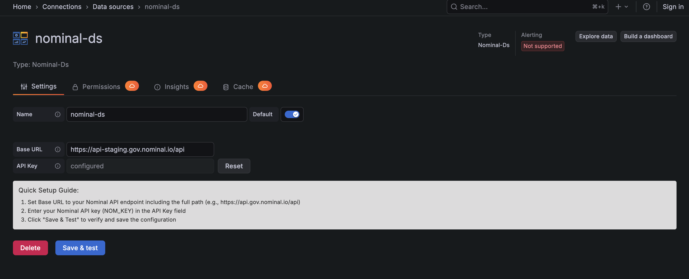
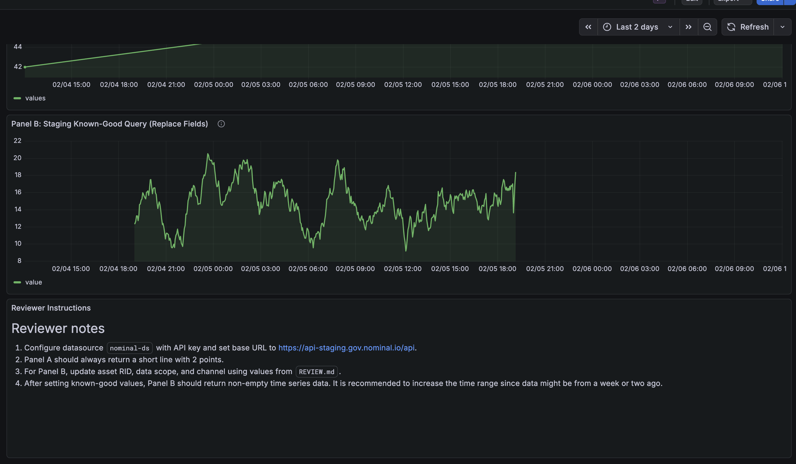

# Grafana Reviewer Bootstrap

This file is for Grafana plugin catalog reviewers and internal release operators.

## Quick bootstrap

1. Start Grafana with provisioning:

```sh
pnpm install
mage -v
pnpm run build
pnpm run server
```

2. Login to Grafana at `http://localhost:3000`:

   - Username: `admin` (or `GRAFANA_ADMIN_USER` from your `.env`)
   - Password: `admin` (or `GRAFANA_ADMIN_PASSWORD` from your `.env`)

3. Open `Connections` -> `Data sources` -> `nominal-ds`.

4. In data source settings:



- Set `Base URL` to staging for reviewer access.
- Set API key from shared reviewer credentials.
- Click `Save & test` and expect success.

5. Open dashboard:
   - `Dashboards` -> `Nominal Review` -> `Nominal Plugin Reviewer - Bootstrap Dashboard`



Panel mapping in provisioned dashboard:

- Panel A: deterministic sanity query (no Nominal data dependency).
- Panel B: real staging query using the tuple above.

## CSV fixture for creating review data

If you need deterministic test data, ingest:

- `review/fixtures/nominal-review-seed.csv`

Suggested channel names from this file:

- `speed_mps`
- `battery_pct`
- `temperature_c`
- `altitude_m`

A good reference for ingestion of data is [docs.nominal.io](https://docs.nominal.io/).
Please login using the provided reviewer credentials and grafana email.
