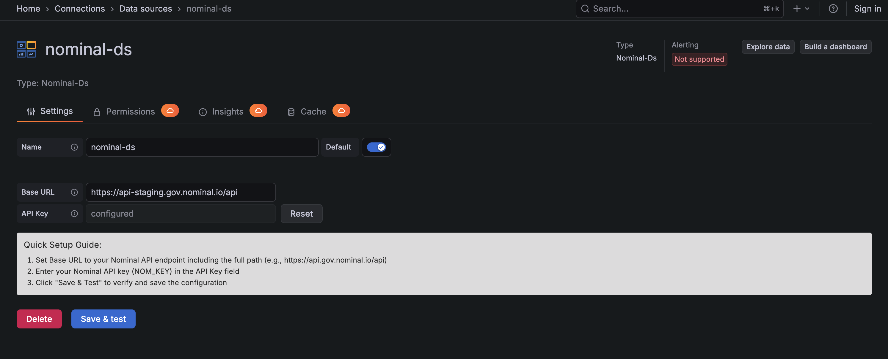
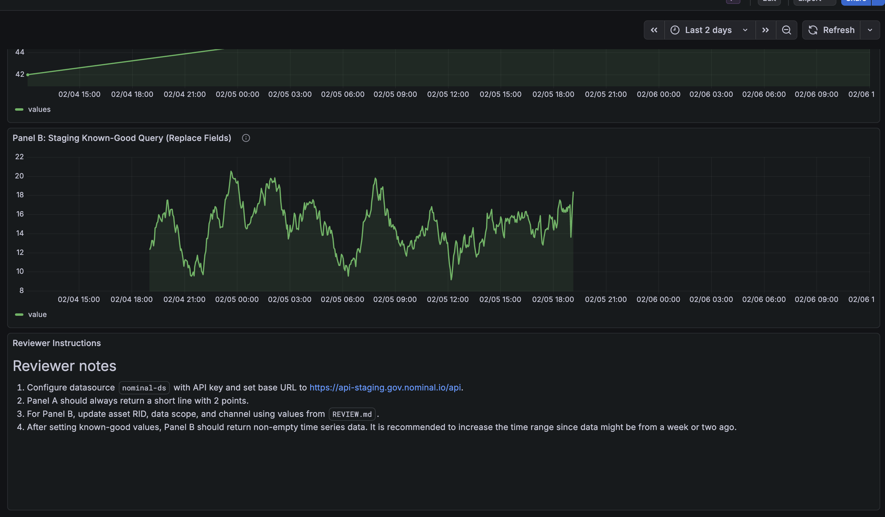

# Grafana Reviewer Bootstrap

This file is for Grafana plugin catalog reviewers and internal release operators.

## Quick bootstrap

1. Start Grafana with provisioning:

```sh
pnpm install
mage -v
pnpm run build
pnpm run server
```

2. Login to Grafana at `http://localhost:3000`:

   - Username: `admin` (or `GRAFANA_ADMIN_USER` from your `.env`)
   - Password: `admin` (or `GRAFANA_ADMIN_PASSWORD` from your `.env`)

3. Open `Connections` -> `Data sources` -> `nominal-ds`.

4. In data source settings:



- Set `Base URL` to `https://api-staging.gov.nominal.io/api`.
- Set API key from shared reviewer credentials.
- Click `Save & test` and expect success.

5. Open dashboard:
   - `Dashboards` -> `Nominal Review` -> `Nominal Plugin Reviewer - Bootstrap Dashboard`



Panel mapping in provisioned dashboard:

- **Panel A**: deterministic sanity query (no Nominal data dependency — always renders).
- **Panel B**: live staging query. This panel queries a continuously updated dataset
  on staging, so it should render non-empty series at any time. Use the default
  "Last 6 hours" time range or any recent window.

  If Panel B appears empty, verify the data source Base URL is set to
  `https://api-staging.gov.nominal.io/api` and the API key is configured.

## Documentation reference

For general Nominal platform documentation, visit
[docs-staging.gov.nominal.io](https://docs-staging.gov.nominal.io/).
Login with the provided reviewer credentials and the email `grafana-plugin@allnominal.com`.
