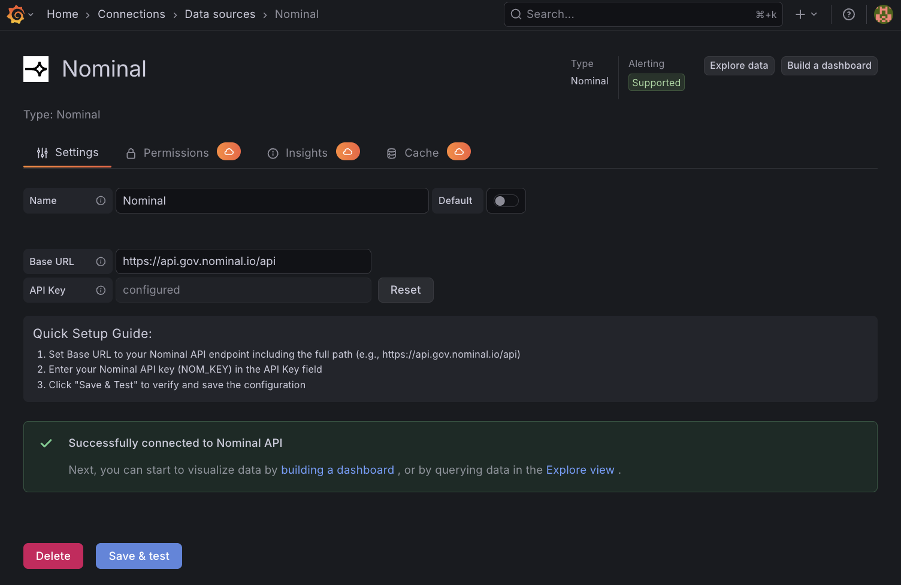
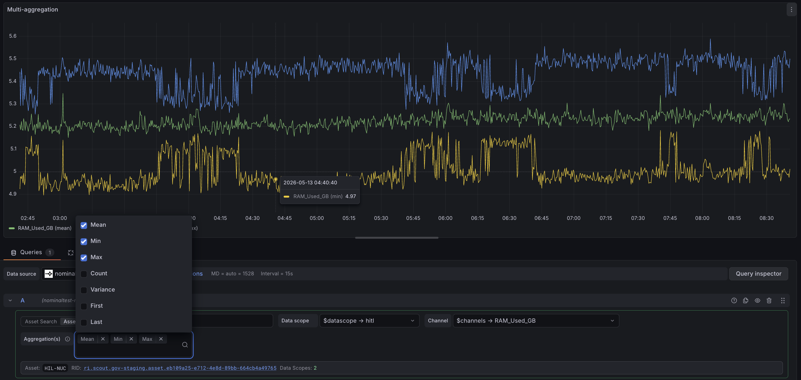
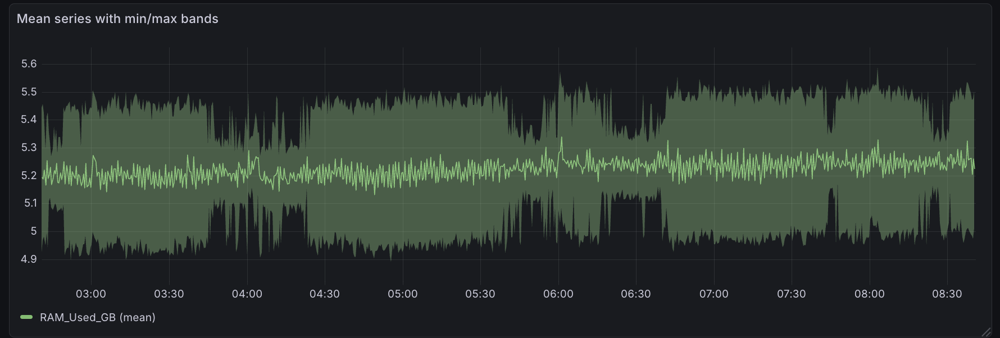
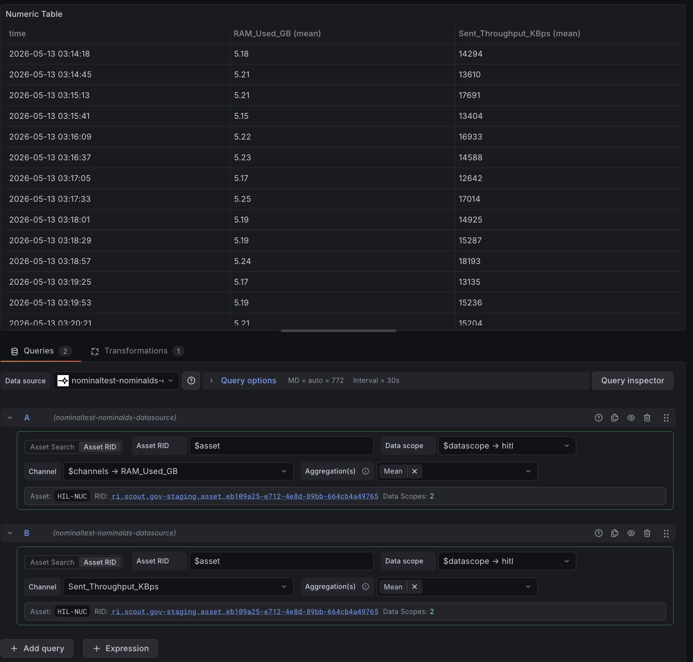
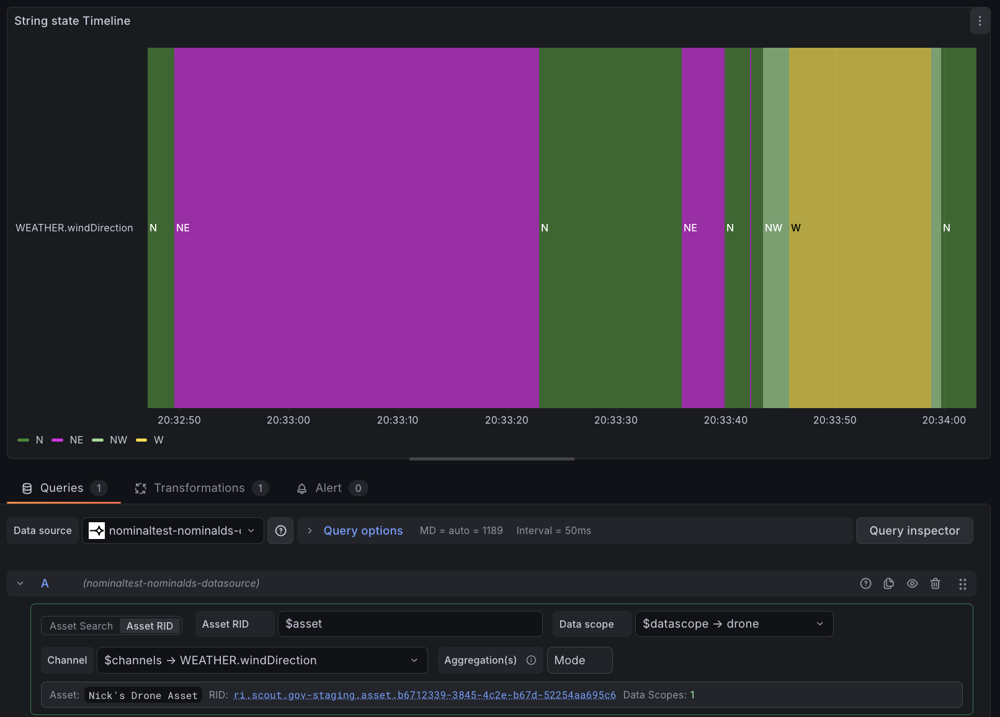

# Nominal

The Nominal data source for Grafana connects dashboards, Explore, and template variables to Nominal time-series data. Use it to search Nominal assets, pick data scopes and channels, and visualize numeric, string, and log channels alongside the rest of your Grafana telemetry.

## Requirements

- Grafana 12.1 or later.
- A Nominal API key.
- Access to a Nominal API endpoint, such as `https://api.gov.nominal.io/api`.

## Install and configure

1. In Grafana, go to **Connections** > **Data sources**.
2. Add the **Nominal** data source.
3. Set **Base URL** to your Nominal API endpoint, including the `/api` path.
4. Enter your Nominal API key in **API Key**.
5. Select **Save & test**.

Grafana stores the API key securely and sends it only to the Nominal backend plugin. The health check verifies that Grafana can reach Nominal and authenticate with the configured key.

## Query basics

The query editor follows a three-step pattern:

1. Search for an asset by name, or paste a Nominal resource identifier (RID) like `ri.scout.<instance>.asset.<uuid>`.
2. Pick a data scope from the asset.
3. Pick a channel from the data scope.

Queries return Grafana data frames usable in dashboards and Explore.

## Channel types

### Numeric

Most physical telemetry: temperatures, pressures, currents, vibration amplitudes.

Numeric channels expose an **Aggregation(s)** picker. Each selected aggregation is computed per time bucket and returned as its own series:

- **Mean** — overall shape and trend. The default, and what most line charts want.
- **Min** / **Max** — catch extrema that a mean smooths away. Pair with Mean to render a banded series (min/max envelope around the mean).
- **First** / **Last** — the actual sample value and its real timestamp inside each bucket, not a derived statistic. Use when you need a true `(value, time)` pair for State panels, sparse signals, or correlating with external events.
- **Count** — number of samples per bucket. Useful for sanity-checking decimation, spotting gaps, or detecting changes in sample rate.
- **Variance** — within-bucket spread. Flags noisy or unstable intervals without leaving the panel.

String channels are locked to **Mode** (most-frequent value in the bucket). Log channels return raw entries without aggregation.

Selecting multiple aggregations at once returns each as its own series, so a single panel can show min, max, and mean together.

Rendered as a banded series, the same min/max/mean output highlights variance around the mean.

Reach for a Table panel for exact values, spot-checks, or embedding numeric data inside summary dashboards.

### String

Categorical telemetry: states, modes, fault codes.

State Timeline colors each segment by string value over time, making state transitions visible at a glance.

A Table panel lists each value change with its timestamp, which reads cleanly when transitions are infrequent.

### Log

Event-style records with a message field.

Grafana's Logs panel renders Nominal log records inline with other telemetry from the same dashboard.

## Dashboards and template variables

Nominal supports Grafana dashboard variables for assets, data scopes, and channels, so one dashboard can switch Nominal contexts without editing each panel. Use any of the following in a Grafana **Variables** definition.

### Variable queries

- `assets` returns every asset in the workspace. Use it as the top variable in an asset-driven dashboard built from scratch.
- `assets(engine)` returns assets matching the search text `engine`. Matching is case-insensitive, tolerates minor typos, and looks at the asset's name, description, labels, and properties — so `engine`, `engines`, and `enigne` all find `Engine 1`. Use this to scope a dashboard to a fleet or family when your assets share a naming pattern — `assets(turbine)`, `assets(pack)`, `assets(vehicle)`.
- `datascopes(${asset})` returns every data scope on the selected asset. Chain it directly under an `assets` variable so the data scope dropdown refreshes when the user picks a different asset.
- `channels(${asset})` returns the union of channel names across **all** data scopes on the selected asset, deduplicated by name. Most useful when your asset has a single primary data scope, or when your fleet uses a consistent scope name that you can pin as a literal in each panel's data scope field. If channels with the same name exist in multiple scopes, the variable shows the name once — the actual data returned depends on which scope is set in each panel.
- `channels(${asset}, ${datascope})` returns channels filtered to the selected asset and data scope. This is the canonical pattern for production dashboards: pick an asset, pick its data scope, then pick a channel scoped to that pair.

### Common patterns

**Single-asset multi-channel monitoring.** One named asset, several panels, no template variables. Each panel shows one or more channels from the asset's data scopes. The most common shape for a dedicated operations dashboard like "Engine A1 Live" or "Battery Pack 7".

**Single-asset deep-dive.** Three chained variables (`assets`, `datascopes(${asset})`, `channels(${asset}, ${datascope})`) drive every panel. Switching the asset cascades through scopes and channels automatically. Use this when you want one reusable dashboard for any asset of a given shape.

**Fleet view.** One filtered asset variable (e.g. `assets(engine)`) set to multi-value, plus `channels(${asset})` for a flat channel picker. Each panel shows the same channel as multiple series, one per selected asset. This pattern assumes every asset in the fleet exposes the same channel under the same data scope name; pin that scope as a literal in each panel's **Data scope** field rather than parameterizing it.

**Per-channel panel repeat.** A multi-value channel variable (`channels(${asset}, ${datascope})` set to multi-value) combined with Grafana's panel **Repeat options** clones one panel per selected channel. The dashboard resizes itself to the analyst's selection. The same repeat trick works on a multi-value asset variable when you want one panel per asset instead of one panel with multiple series.

## Troubleshooting

- If **Save & test** fails, confirm that the Base URL includes the `/api` path and that the API key is valid.
- If asset or channel search fails, confirm that the data source can reach Nominal and that the API key has access to the requested data.

## Known limitations

- Annotations are not yet supported.

## Links

- Nominal: https://www.nominal.io/
- Documentation: https://docs.nominal.io/
- Source repository: https://github.com/nominal-io/grafana-plugin-public
- Grafana plugin development documentation: https://grafana.com/developers/plugin-tools
